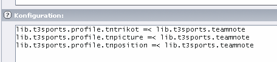
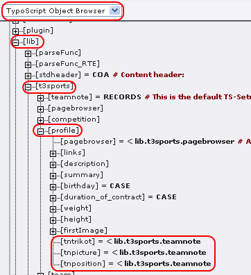

# Häufige Aufgabenstellungen

## Verwendung von Team-Notizen

Mit der Version 0.4.4 von T3sports FE können im Frontend die sogenannten Team-Notizen ausgegeben werden. Damit wird die 
Möglichkeit gegeben einem Spieler in Abhängigkeit zu einem bestimmten Team weitere Informationen zu zuordnen. Am Beispiel 
der Rückennummer lässt sich das sehr gut verdeutlichen. Diese Nummer kann für einen Spieler von Jahr zu Jahr 
unterschiedlich sein. Daher kann diese Informationen nicht direkt im Spieler abgespeichert werden, weil sie dann jedes 
Jahr durch eine neue Nummer ersetzt werden müsste. Man würde also die Historie der Daten verlieren.

Mit der **Team-Notiz** liefert T3sports die passende Datenstruktur für diese Information. Im folgenden Beispiel wird gezeigt, 
wie man Rückennummern und ein zusätzliches Bild für den Spieler als Team-Notiz anlegt und im Frontend ausgibt. Für alle Aktionen 
wird das **Modul Liste** verwendet.

* Schritt 1: Notiz-Typen anlegen

Die Notiz-Typen legt man am besten im Root-SysFolder der Ligaverwaltung an. Also da wo auch die Altersgruppen oder 
Saisondatensätze liegen sollten. 

Die wichtigste Information des Notiz-Typ ist das Feld HTML-Marker. Der Wert dieses Feldes  wird später Bestandteil des 
HTML-Markers in der HTML-Vorlage. Auch für das Typoscript-Setup wird dieser Wert benötigt.

Der Marker sollte auch keine Sonder- oder Leerzeichen enthalten. Für unser Beispiel legen wir zwei Datensätze an. Für die 
Trikotnummer benennen wir den HTML-Marker trikot, für das Saisonbild wählen wir picture.

* Schritt 2: Die Team-Notizen erstellen

Die Team-Notizen werden immer in dem SysFolder angelegt, in dem auch die Team-Datensätze liegen. In diesem SysFolder wählt 
man also Neuen Datensatz erstellen und sucht diesmal als Typ die Teamnotiz heraus.

Der Typ des Werts ist entweder **Text**, **Media** oder **Ganzzahl**. Entsprechend der Auswahl wird sich das Formular ändern. 
Für die Trikotnummer wählt man die Ganzzahl, beim Saisonbild nimmt man Media. In der Box Mannschaft stehen alle Teams zur 
Auswahl, die sich im aktuellen SysFolder befinden. Darum muss sich die Team-Notiz auch immer im passenden SysFolder befinden. 
Ist ein Team ausgewählt, füllt sich die Box Person mit allen Spielern des Teams und der betreffende Spieler kann gewählt werden.

* Schritt 3: Frontendausgabe

Die Ausgabe der Daten erfolgt derzeit ausschließlich über den View Teamdarstellung. Den HTML-Marker ermittelt man nach folgendem 
Prinzip: `###TEAM_PLAYER_TN[HTML-Marker]###`

Für unsere beiden Beispiele müssen also diese Marker verwendet werden:
```
###TEAM_PLAYER_TNTRIKOT###
###TEAM_PLAYER_TNPICTURE###
```

* Schritt 4: Typoscript-Formatierung

Damit die Daten im FE ausgegeben werden, muss jeweils eine zusätzliche Angabe im TypoScript Template gemacht werden.  Auch hier ist 
wieder der in der Team-Notiz verwendete HTML-Marker von Bedeutung. Die Konfiguration muss im TS-Objekt für den Spieler gemacht werden. 
Am besten verwendet man dafür das Default-Objekt **lib.t3sports.profile.**



Wenn statt dem Wert der Team-Notiz nur die UID ausgegeben wird, dann stimmt die Typoscript-Konfiguration nicht. Am besten prüft man 
in diesem Fall das TS-Setup mit dem Typoscript-Objectbrowser. Dieser befindet sich im Modul Templates. Im Seitenbaum wählt man die 
Seite, auf der die Ausgabe erfolgen soll. Die Typoscript-Konfiguration sollte dann so wie im Screenshot abgebildet sein.




## Integration der Spiele als Event in der Extension Calendar base (cal)

**DERZEIT DEFEKT!**

Es ist möglich die Spiele als Termine in einem Kalender darzustellen. Dafür müssen die folgenden Schritte durchgeführt werden:
Über den Extension Manager muss in der Extension T3sports FE die Option Enable Integration for Calendar Base aktiviert werden.
Anschließend muss das static Template League Management cal-events eingebunden werden. Dieses muss unbedingt nach dem normalen 
static Template der Extension stehen, da es sich auf dessen Angaben bezieht!

Im Plugin des Kalenders muss die Seite mit den Spielen nun als Quelle für Termine mit angegeben werden:
Die Gestaltung des Layouts geschieht über ein HTML-Template. Eine Vorlage liegt unter 
**ext:cfc_league_fe/Resources/Private/Templates/Html/match_event.html**.

Damit nun nicht alle Spiele gezeigt werden, kann wie üblich die Auswahl vorher eingeschränkt werden. In diesem Fall aber nur 
per Typoscript:

```
plugin.tx_cal_controller {
  view.cfc_league_events {
    # Eigenes Template einbinden
    template = fileadmin/templates/match_events.html
    # Es kann auf die gleichen Werte, wie in den normalen Views eingegrenzt werden
    # Andernfalls werden alle Spiele im Kalender eingetragen
    # Die folgenden Werte sind jeweils UIDs und müssen natürlich angepaßt werden!
    # Die Saison wird nicht eingegrenzt, damit sind jedes Jahr aktualisiert werden muss
#    saisonSelection =
    # Altersklasse festlegen
    groupSelection = 1
    # Vereinsauswahl
    clubSelection = 3
    # Wettbewerbsauswahl in diesem Fall nicht gesetzt
#    competitionSelection = 
  }
}
```

In diesem Typoscript-Beispiel werden also alle Spiele gefunden, deren Altersklasse die UID 1 hat und bei denen Teams des Vereins 
mit der UID 3 antreten.

Diese Angaben können auch direkt im Plugin von Calendar Base im Tab Typoscript eingegeben werden. Dann muss man die äußere 
Klammer natürlich weglassen (plugin.tx_cal_controller).

Bei Problemen ist es möglich, die Datenbank-Query im FE anzeigen zu lassen, mit der die Spiele in der Datenbank gesucht werden. 
Dafür muss  man im Plugin von Calendar Base im Tab Typoscript folgende Angabe machen:

`view.cfc_league_events.debug = 1`

**Weitere Optionen:**
```
view.cfc_league_events.ignoreDummy = 0/1 (Spielfrei nicht anzeigen)
view.cfc_league_events.competitionTypes = 0/1/2 (Wettbewerbstypen: Sonstige/Liga/Pokal)
view.cfc_league_events. CompetitionObligation = 0/1/2 (Pflichtwettbewerbe: Alle/Pflicht/Freundschaft)
view.cfc_league_events.limit = 10 (maximale Anzahl Ergebnisse)
view.cfc_league_events.liveticker = 0/1 (Nur Livetickerspiele anzeigen)
```

Darüber hinaus können weitere Angaben direkt über die üblichen Fields und Options gesetzt werden:
```
view.cfc_league_events.fields.
view.cfc_league_events.options.
```

Sollte nach dieser Angabe im FE keine Ausgabe erfolgen, dann ist die Integration nicht korrekt konfiguriert. Ursache kann eine 
falsche Reihenfolge der Static Templates sein oder eine fehlende Aktivierung über den Extension Manager.


## Einen Teaser für das nächste Spiel einer Mannschaft erstellen

Für diese Darstellung wird der View Spielplan verwendet. Wir müssen den Scope zunächst so einstellen, daß wir einen 
Mannschaftsspielplan erhalten. Es muss also mindestens die Altersklasse und der Verein des Teams festgelegt werden. 
Optional kann natürlich auch die Saison und der Wettbewerb eingeschränkt werden. Bei letzterem kann man dann zum Beispiel 
auch speziell das nächste Pokalspiel anzeigen.
```
# Ein neues Objekt anlegen, daß später z.B. einem Marker zugeordnet werden kann.
lib.nextMatch < plugin.tx_cfcleaguefe_competition
  action = tx_cfcleaguefe_actions_MatchTable
  # UID der Saison
  saisonSelection = 4
  # UID der Altersklasse
  groupSelection = 1
  # UID des Vereins
  clubSelection = 3
  # Der Wettbewerb wird nicht eingeschränkt
#  competitionSelection =
  # Sicher soll ein spezielles Template verwendet werden
  matchtableTemplate = fileadmin/templates/nextmatch_teaser.html
  # Nur Spiele der nächsten 20 Tage betrachten
  matchtable.timeRangeFuture = 20
  # Jetzt die Ergebnisliste auf das erste Spiel beschränken
  matchtable.options.limit = 1
  # nur angesetzte und laufende Spiele anzeigen
  matchtable.fields.MATCH.STATUS.OP_IN_INT = 0,1
}
```

## Einen Teaser für das letzte Spiel einer Mannschaft erstellen
Im Prinzip funktioniert das wie im vorherigen Beispiel. Es sind nur kleine Anpassungen notwendig:
```
lib.lastMatch =< lib.nextMatch
lib.lastMatch {
  matchtable {
    fields.MATCH.STATUS.OP_IN_INT = 2
    # Wichtig: Absteigend nach Datum sortieren!
    options.ORDERBY.MATCH.DATE = DESC
    timeRangePast = 20
    timeRangeFuture = 1
  }
}
```

## Erstellung eines Teasers der aktuellen Ligatabelle
Man kann recht einfach auch eine Kurztabelle erstellen, die man dann am Seitenrand als Teaser plaziert. Mit TypoScript sind die folgenden Angaben notwendig:

```
lib.shortTable < plugin.tx_cfcleaguefe_competition
lib.shortTable {
  action = tx_cfcleaguefe_actions_LeagueTableShow
  tablescope = 0
  tabletype = 0
  # Hier die UID des Vereins
  leaguetable.tablecfg.markClubs = 123 
  # Hier die UID des Wettbewerbs
  competitionSelection = 123 
  leaguetableTemplate = fileadmin/mytableteaser.html
  # Anzahl der gezeigten Teams
  leaguetable.tablecfg.tableSize = 5 
}
```
## Das Objekt lib.shortTable kann man dann in einen Marker seines Typoscript-Templates einbauen.

Es ist auch möglich die Anzahl der Teams in der Tabelle direkt über das Plugin zu ändern. Hierzu gibt man im Tab Typoscript 
einfach diese Zeile ein: `leagueTableSize = 5 `

## Umgang mit Bildern
Mit der Version 0.6.0 wurde eine Umstellung der Bildausgabe vorgenommen. Die Ausgabe der Bilder erfolgt jetzt über eine  einheitliche Schnittstelle und kann per Typoscript und einem HTML-Template (fast) beliebig angepasst werden. Es sollte möglich sein, so gut wie jede Javascript-Gallerie einzubinden. Vorlagen für Lightbox und Galleriffic werden bereits mitgeliefert.

Am Beispiel des Spielberichts soll gezeigt werden, wie man eine Gallerie für die Ausgabe der Bilder einbindet. Im HTML-Template des Spiels befindet sich lediglich der Marker ###MATCH_PICTURES###. Diesem ist per Typoscript folgende Konfiguration zugewiesen:

```
lib.t3sports.match {
  pictures = USER
  pictures {
    userFunc = tx_rnbase_util_TSFAL->printImages
    refField = t3images
    refTable = tx_cfcleague_games
    template = EXT:cfc_league_fe/Resources/Private/Templates/Html/lightboxpics.html
    subpartName = ###PICTURES###
    media {
      file = IMG_RESOURCE
      file.file.import.field = file
      file.file.maxW = {$plugin.tx_cfcleaguefe_report.maxW_matchPicture}
      file.file.maxH = {$plugin.tx_cfcleaguefe_report.maxH_matchPicture}
      thumbnail < .file
      thumbnail = IMAGE
      thumbnail.file.maxW = {$plugin.tx_cfcleaguefe_report.maxW_matchThumb}
      thumbnail.file.maxH = {$plugin.tx_cfcleaguefe_report.maxH_matchThumb}
      thumbnail.params = border="0"
      thumbnail.titleText.field = title
    }
  }
}
```

Wichtig ist zunächst der Verweis auf das HTML-Template lightboxpics.html. In diesem befindet sich im Subpart ###PICTURES### 
die Vorlage für die Ausgabe der Bilder. Für die Lightbox hat er folgendes Aussehen:

```
###PICTURES###
###MEDIAS######MEDIA###
<a href="###MEDIA_FILE###" rel="lightbox[pictures]">###MEDIA_THUMBNAIL###</a>
###MEDIA######MEDIAS###
###PICTURES###
```
Es handelt sich also um eine gewöhnliche Listenausgabe. Die Typoscript-Formatierung für MEDIA, es handelt sich hier um 
Datensätze der Tabelle tx_dam, befindet sich mit im obigen TS-Code. Die Ausgabe verwendet nur die Marker **MEDIA_FILE** 
und **MEDIA_THUMBNAIL**. Der erste Marker liefert die URL aus das komplette Bild und der zweite Marker ein Image-Tag auf 
das Thumbnail.

Damit nun wirklich eine Lightbox angezeigt wird, muss man das notwendige Javascript noch in die Seite einbinden. Dafür 
kann man z.B. auf der FE-Seite mit dem Spielbericht ein neues Typoscript-Template anlegen und folgenden Code integrieren:

```
page.headerData.77 = TEXT
page.headerData.77.value (
<link rel="stylesheet" href="fileadmin/lightbox/css/lightbox.css" type="text/css" media="screen" />
<script type="text/javascript" src="fileadmin/lightbox/js/prototype.js"></script>
<script type="text/javascript" src="fileadmin/lightbox/js/scriptaculous.js"></script>
<script type="text/javascript" src="fileadmin/lightbox/js/lightbox.js"></script>
)
```
Die entsprechenden Dateien müssen natürlich an der angegebenen URL vorhanden sein.

### Galleriffic

Um die Bildausgabe auf Galleriffic umzustellen, sind zwei Änderungen notwendig. Erstens muss die HTML-Vorlage auf die 
Datei EXT:cfc_league_fe/Resources/Private/Templates/Html/gallerifficpics.html umgestellt werden. Speziell für den Spielbericht ist folgende TS-Anweisung
möglich:
```
plugin.tx_cfcleaguefe_report {
  matchreport.match.pictures.template = EXT:cfc_league_fe/Resources/Private/Templates/Html/gallerifficpics.html
}
```

Und dann muss natürlich noch die JS-Bibliothek gewechselt werden:
```
page.headerData.55 = TEXT
page.headerData.55.value (
<link rel="stylesheet" href="fileadmin/galleriffic/css/basic.css" type="text/css" />
<link rel="stylesheet" href="fileadmin/galleriffic/css/galleriffic-2.css" type="text/css" />
<script type="text/javascript" src="fileadmin/galleriffic/js/jquery-1.3.2.js"></script>
<script type="text/javascript" src="fileadmin/galleriffic/js/jquery.galleriffic.js"></script>
<script type="text/javascript" src="fileadmin/galleriffic/js/jquery.opacityrollover.js"></script>
)
```

## Verschiedene Altersklassen in einem Wettbewerb
Es ist grundsätzlich möglich, daß in einem Wettbewerb verschiedene Altersklassen gegeneinander antreten. In Pokal-Wettbewerben 
sind z.B. häufig neben der 1. Mannschaft auch Teams der U23 vertreten. Mit Version 0.6.0 können daher einem Wettbewerb mehrere 
Altersklasse zugeordnet werden. Um dann auch weiterhin eine Einschränkung des Scopes auf die Spieler genau einer Altersklasse 
zu ermöglichen, kann auch im Teams genau eine Altersklasse eingestellt werden. Diese Erweiterung des Datenmodells hat Auswirkungen 
auf die meisten Ausgaben des Wettbewerbs-Plugins.
Um bspw. den Team-Spielplan der U23 eines Vereins zu zeigen, setzte man bisher den Scope auf die Altersgruppe „U23“ und den Verein 
auf den gewünschten Wert. Wenn aber jetzt zwei Teams des selben Vereins im selben Wettbewerb spielen, dann werden natürlich zu 
viele Spiele geliefert. Als Lösung muss man zusätzlich in den beiden betroffenen Teams die richtige Altersklasse einstellen und 
per Typoscript den Scope erweitern:

```
plugin.tx_cfcleaguefe_competition.scope.teamGroup = 1
```

Mit dieser Anweisung wird zusätzlich noch die Altersklasse des Teams in den Scope mit eingeschlossen. Dieses Vorgehen wirkt dann 
natürlich auch analog bei den Statistiken.

## Link auf Spielbericht aus einer tt_news-Meldung

Seit Version 0.3.3 ist es möglich in Meldungen von tt_news direkte Links auf Views von T3sports zu setzen. Der „Link“ in der Meldung 
hat dabei ein besonderes Format:
```
[t3sports:tsconfigid:parameter{,parameter} Link Label]
```

Das sieht etwas kyptisch aus, ist aber am konkreten Beispiel überschaubar. Hier der Link auf den Spielbericht der Partie mit der 
UID 123:
```
[t3sports:matchreport:123 Zum Spielbericht]
```

Damit dieser Link funktioniert, müssen im Typoscript-Setup von tt_news einige Einstellungen getroffen werden:
```
plugin.tt_news {
  external_links {
    matchreport {
      ext_parameters = matchId
      pid = {$plugin.tx_cfcleaguefe_report.matchreportpage}
    }
    profile {
      ext_parameters = profileId
      pid = {$plugin.tx_cfcleaguefe_competition.playerpage}
    }
  }
}
```
In dieser Konfiguration ist bereits eine weitere Einstellung für die Verlinkung auf einzelne Spieler mit eingebaut. Der 
entsprechende Link hat dann dieses Aussehen:
```
[t3sport:profile:11 Die Person mit der UID 11]
```
Nach diesem Prinzip können auch Links auf weitere Views von T3sports eingerichtet werden.

Beim Link auf den Spielbericht ist zusätzlich die Altersgruppe des Spiels als Register T3SPORTS_GROUP gesetzt. Damit kann 
man die Zielseite dann auch variieren:
```
 plugin.tt_news {
   external_links {
     matchreport {
       ext_parameters = matchId
       pid >
       pid.cObject = CASE
       pid.cObject {
         key.data = register:T3SPORTS_GROUP
         2 = TEXT
         2.value = 123
         default = TEXT
         default.value = {$plugin.tx_cfcleaguefe_report.matchreportpage}
       }
     }
   }
 }
```

In diesem Beispiel wird für die Altersgruppe mit der UID 2 die Zielseite mit der UID 123 verwendet. Für alle anderen 
Altersgruppen wird weiter die Standardseite verwendet.

## Lokalisierung von HTML-Templates

Seit Version 0.4.0 besteht die Möglichkeit beliebige Sprach-Marker in den Views von T3sports zu integrieren. Dafür muss zunächst 
per Typoscript der Marker definiert werden. Als Beispiel soll ein Marker für den Begriff Team angelegt werden. Per Typoscript 
definiert man folgende Übersetzung:
```
plugin.tx_cfcleaguefe_report {
  _LOCAL_LANG {
    default.label_team = Team
    de.label_team = Mannschaft
  }
}
```
In den HTML-Templates des Plugins T3sports: Berichte kann nun der Marker **###LABEL_TEAM###** verwendet werden. Für das Plugin 
T3sports: Ligaverwaltung verwendet man analog folgendes Setup:
```
plugin.tx_cfcleaguefe_competition {
  _LOCAL_LANG {
    default.label_team = Team
    de.label_team = Mannschaft
  }
}
```
Die Sprachmarker beginnen also immer mit LABEL_. Der Rest ist dann frei wählbar und man kann beliebig viele Marker anlegen.
